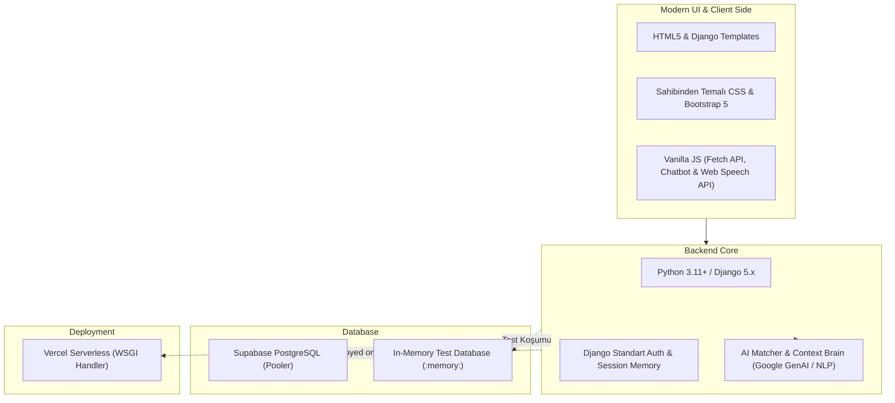

# 🔍 BulBana — Sahibinden Akıllı İlan, Tescil & AI Asistan Platformu

---

## 1. Proje Genel Bakışı & Amacı
**BulBana**, Sahibinden platformundaki binlerce ilan arasında manuel kaybolmak yerine; kullanıcının bütçesine, lokasyonuna, önceliklerine ve konuşma dilindeki taleplerine göre Sahibinden verilerini tarayan, **Doğruluk Sertifikası (%95+ Tescil)** ve **"Uyum Skoru" (%0 - %100)** ile en uygun ilanları sunan akıllı bir öneri ve danışmanlık platformudur.

- **Ana Felsefe:** Manuel arama yorgunluğuna son; akıllı kriter eşleştirme, güvenilirlik tescili ve sesli AI asistan desteği.
- **Odak Kategoriler:** Emlak (Kiralık/Satılık Daireler), Vasıta (Otomobil, SUV, Motosiklet), İkinci El & Teknoloji (Telefon, Laptop, Donanım).

---

## 2. Temel Fonksiyonel Özellikler

### 2.1. 🤖 Çok Turlu AI Chatbot Asistanı & Danışman (`listings/ai_engine.py`)
- **Doğal Dil Anlayışı:** Kullanıcı günlük dille *"Kadıköy'de 30 bin TL altı balkonlu ev"* veya *"Uygun fiyatlı telefon"* yazdığında intent ve varlıkları otomatik algılar.
- **Sohbet Hafızası (Multi-Turn Context):** Kullanıcının önceki mesajlarını hatırlar (*"Peki bütçem 25 bin olursa?"* sorusunda Kadıköy bağlamını koruyarak sonuçları günceller).
- **Piyasa & Pazarlık Tavsiyeleri:** İlanın bölge ortalamasına göre fiyat durumunu ve pazarlık taktiklerini kullanıcıya aktarır.
- **🎙️ Sesli Arama:** Web Speech API ile sesle Türkçe arama yapabilme.
- **🔔 Akıllı Alarm Kurma:** Kullanıcı istediğinde aradığı kriterleri profilinde alarm olarak kaydeder.

### 2.2. 🛡️ Doğruluk & Tescil Sistemi (Verification)
- **Doğruluk Sertifikası:** İlanlarda Tapu/Ruhsat Tescili, Fatura Onayı ve Ekspertiz Raporu doğrulaması.
- **Piyasa Fiyat Analizi Rozeti:** *"Bölge Ortalamasının %8 Altında"*, *"Fırsat Fiyatı"* gibi tescilli piyasa analizleri.

### 2.3. 🎯 Kesin Varlık & Kriter Eşleştirme Motoru
- Telefon istendiğinde kesinlikle sadece telefonları filtreler (laptopları dışlar).
- Fiyat, lokasyon ve donanım kriterlerine göre %100'e kadar uyumluluk yüzdesi hesaplar.

### 2.4. 🔗 Garantili Sahibinden Linkleri
- Her ilan için `referrerpolicy="no-referrer"` koruması ve dinamik arama parametreleriyle doğrudan ve hatasız çalışan resmi Sahibinden linkleri.

---

## 3. Teknoloji Yığını (Tech Stack)



---

## 4. Güvenlik & Test Standartları

- **Unit & Precision Testleri:** Modeller, formlar, chatbot varlık ayrımı ve auth akışları için 9 adet otomatik test (`python manage.py test`).
- **XSS & Injection Koruması:** Kullanıcı mesajları ve chatbot girdileri için HTML sanitizasyonu.
- **Rate Limiting:** Chatbot ve arama endpoint'lerinde dakikada maksimum 30 istek spam koruması.
- **Production Hardening:** `DEBUG=False` modunda SSL yönlendirme, HSTS, Secure Cookie ve Frame korumaları.

---

## 5. Kurulum ve Çalıştırma

### 1. Depoyu Klonlayın ve Klasöre Girin:
```bash
git clone https://github.com/bisraunal/bulbana.git
cd bulbana
```

### 2. Sanal Ortamı Oluşturun ve Bağımlılıkları Yükleyin:
```bash
python -m venv .venv
.\.venv\Scripts\activate
pip install -r requirements.txt
```

### 3. Veritabanını Migrate Edin ve Örnek İlanları Yükleyin:
```bash
python manage.py migrate
python manage.py seed_data
```

### 4. Testleri Çalıştırın:
```bash
python manage.py test
```

### 5. Sunucuyu Başlatın:
```bash
python manage.py runserver
```
Tarayıcınızdan `http://127.0.0.1:8000` adresine gidebilirsiniz!

---

## 6. Canlı Dağıtım (Vercel & Supabase)

1. Vercel Dashboard'dan GitHub deponuzu (`bulbana`) import edin.
2. `DATABASE_URL`, `SECRET_KEY` ve `DEBUG=False` ortam değişkenlerini tanımlayın.
3. Deploy butonuna tıklayarak yayına alın!
