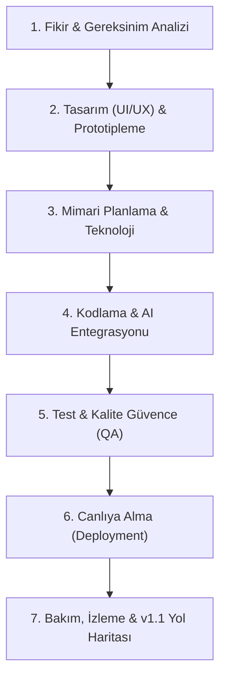
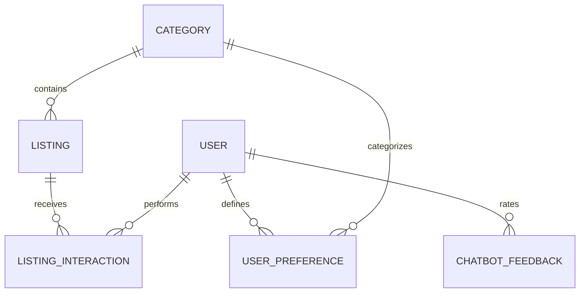

# 🔍 BulBana — Kapsamlı Ürün Geliştirme & Mimari Dokümantasyonu (SDLC)

Bu doküman, **BulBana** (Sahibinden Akıllı İlan, Değerleme & AI Danışmanlık Platformu) projesinin 7 aşamalı Yazılım Yaşam Döngüsü (SDLC) ve ürün geliştirme metodolojisini adım adım detaylandırmaktadır.

---

---

## 1. Fikir ve Gereksinim Analizi (Planlama)

### 🎯 Problemi ve Hedefi Tanımlama
* **Problem:** Sahibinden üzerinde yüz binlerce ilan arasında arama yaparken; sahte/abartılı ilanlar, fahiş fiyatlandırmalar, yetersiz filtreler ve vakit kaybı yaşanması.
* **Çözüm (BulBana):** 
  - İlanları **Doğruluk Skoru (%0-%100)** ve Tapu/Ruhsat/Fatura tescil rozetleriyle doğrulamak.
  - Kullanıcının kriterlerine göre **Uyum Skoru** hesaplayan akıllı motor.
  - **Google Gemini 2.5 Flash RAG** destekli Akıllı Asistan ile sesli/yazılı sohbet ve pazarlık tavsiyesi.
* **Hedef Kitle:** Ev, araba ve ikinci el teknoloji arayan, doğru fiyata güvenilir ilan bulmak isteyen alıcılar ve yatırımcılar.

### 📊 Pazar ve Rakip Analizi
| Platform | Güçlü Yönü | Eksik Yönü | BulBana Farkı |
| :--- | :--- | :--- | :--- |
| **Klasik İlan Siteleri** | Geniş ilan havuzu | Güvenilirlik kontrolü yok, arama filtreleri statik | AI destekli tescil puanı ve doğrudan doğru Sahibinden arama linki |
| **Fiyat Kıyaslama Siteleri** | Sadece sıfır ürünler | İkinci el, vasıta ve emlak analizi yapamaz | 3 ana kategoride (Emlak, Vasıta, Teknoloji) derin piyasa analizi |

### 📋 Gereksinim Listesi (Feature List & MVP)
* [x] **MVP:** Kategori hiyerarşisi, dinamik ilan filtreleme ve Sahibinden doğrudan arama linki.
* [x] **Doğruluk & Tescil Sistemi:** Tapu, ruhsat, fatura doğrulama rozetleri ve piyasa fiyat farkı.
* [x] **AI Chatbot Asistanı:** Multi-turn hafızalı, sesli arama destekli, şehir ve kategori izolasyonlu akıllı asistan.
* [x] **AI Pazarlık & Teklif Üretici:** İlan özelinde 3 farklı tonda kopyalanabilir satıcı teklif mesajı üretme.
* [x] **İlan Kıyaslama Motoru:** Birden fazla ilanı yan yana tartıp galip belirleme.
* [x] **Geri Bildirim Sistemi:** Chatbot yanıtlarını 👍 / 👎 ile puanlama ve telemetri.

---

## 2. Tasarım (UI/UX) ve Prototipleme

### 🎨 Tasarım Dili & Prensipler
* **Renk Paleti:**
  - `İkonik Sahibinden Sarısı`: `#FFE800` (Header, birincil aksiyonlar)
  - `Kurumsal Antrasit / Lacivert`: `#1F2C39` (Yazılar, butonlar, logolar)
  - `Sade & Ferah Arka Plan`: `#F8FAFC`
  - `Zarif Kenarlıklar`: `#E2E8F0`
  - `Tescil Güven Yeşili`: `#10B981`
* **UX Yolculuğu (User Journey):**
  1. *Ana Sayfa:* Sade arama çubuğu ve öne çıkan tescilli vitrin ilanları.
  2. *Asistan Etkileşimi:* Tek tıkla açılan yüzen chatbot veya sesli komut.
  3. *İlan Detay:* Fiyat, teknik parametreler, tescil sertifikası ve AI Pazarlık butonu.
  4. *Doğrudan Sahibinden:* Güvenli `referrerpolicy="no-referrer"` ile doğrudan ilgili ilana/aramaya yönlendirme.

---

## 3. Mimari Planlama ve Teknoloji Seçimi

### 🏗️ Teknoloji Yığını (Tech Stack)
* **Backend:** Python 3.11+, Django 5.x
* **Veritabanı:** Supabase (Barındırılan PostgreSQL) & Yerel SQLite
* **Frontend:** Django Templates, Vanilla HTML5, Bootstrap 5, Modern CSS, Vanilla JS (Fetch API)
* **AI & LLM:** Google GenAI SDK (`gemini-2.5-flash`), Hibrit RAG & Yerel Heuristic Engine
* **Statik Dosya & Performans:** WhiteNoise (Gzip / Brotli sıkıştırma)
* **Dağıtım (Deployment):** Vercel Serverless WSGI Handler

### 🗄️ Veritabanı Modelleri (ER Şeması)

---

## 4. Kodlama ve Geliştirme (Geliştirme Aşaması)

* **Modüler Yapı:**
  - `core/`: Proje ayarları (`settings.py`, `wsgi.py`, `urls.py`).
  - `listings/`: İlanlar, filtreler, AI motoru (`ai_engine.py`), testler (`tests.py`), yönetim komutları (`seed_data.py`).
  - `accounts/`: Kullanıcı profilleri, giriş/kayıt ve oturum yönetimi.
  - `templates/`: Sade, modüler ve responsive Django şablonları.
  - `static/`: İkonik sarı-lacivert CSS, sesli komut ve chatbot JS motorları.

---

## 5. Test ve Kalite Güvence (QA)

### 🧪 Yapılan Testler (13/13 Başarılı)
1. `test_car_search_only_returns_vehicles`: Araba sorgusunda sadece vasıta dönmesi garantisi.
2. `test_ankara_search_never_returns_istanbul`: Şehir izolasyonu testi.
3. `test_combined_city_and_product_precision`: "Ankara'da satılık araba" kesinlik testi.
4. `test_xss_protection`: Zararlı script ve HTML enjeksiyonu temizleme testi.
5. `test_greeting_behavior`: Selamlaşma ve doğal karşılama testi.
6. `test_ai_negotiation_offers`: 3 tonlu pazarlık teklifi üretim testi.
7. `test_ai_comparison_endpoint`: İlan kıyaslama ve galip tespiti testi.
8. `test_chatbot_feedback_endpoint`: 👍 / 👎 geri bildirim kayıt testi.
9. `test_matching_algorithm`: Arayış kriteri ve ilan uyum skoru testi.
10. `test_sahibinden_link_generator`: Sahibinden doğrudan arama linki testi.
11. `test_login_view`: Kullanıcı giriş testi.
12. `test_register_view`: Kullanıcı kayıt testi.
13. `test_profile_view`: Profil ve kaydedilen arayışlar testi.

---

## 6. Canlıya Alma ve Yayına Geçiş (Deployment)

* **Vercel Serverless WSGI:** `vercel.json` ve `build_files.sh` derleme yapılandırması hazır.
* **Güvenlik Başlıkları:** `DEBUG=False` durumunda HTTPS yönlendirmesi, HSTS, XSS filtresi ve Secure Cookie korumaları otomatik aktifleşir.
* **Ortam Değişkenleri:** `.env.example` hazır; `DATABASE_URL` (Supabase), `SECRET_KEY`, `ALLOWED_HOSTS`, `GEMINI_API_KEY`.

---

## 7. Bakım, İzleme ve Gelecek Sürümler (v1.1 Roadmap)

* **Telemetri:** Chatbot geri bildirimleri (`ChatbotFeedback`) üzerinden model yanıt kalitesi izleme.
* **v1.1 Yol Haritası:**
  - PWA (Telefona mobil uygulama olarak indirme).
  - İlan listeleme sayfasında çoklu kutucuk seçimiyle canlı kıyaslama çubuğu.
  - Fiyat geçmişi ve bölge trend grafikleri (Chart.js).
