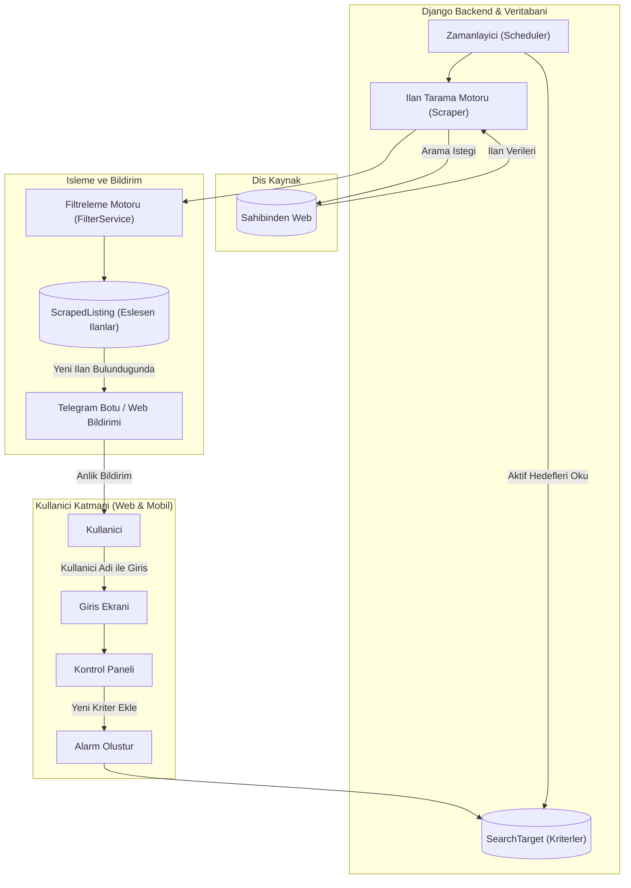

# BulBana - Akilli Ilan Takip ve Anlik Bildirim Platformu
## Proje Mimari ve Gelistirme Dokumani

---

## 1. Proje Ozeti ve Amaci

BulBana, kullanicinin belirledigi ozel kriterlerdeki (orn: Belirli marka, model, renk, hasarsizlik durumu, fiyat araligi, konum ve emlak oda sayisi vb.) ilanlari Sahibinden uzerinde otomatik ve periyodik olarak tarayan, kriterlere uyan yeni bir ilan yayinlandigi anda kullaniciya anlik bildirim (Telegram Botu ve Web Paneli) gonderen ve uygun ilanlari filtreleyip listeleyen ucretsiz bir ilan takip platformudur.

---

## 2. Teknoloji Mimarisi (Tech Stack)

Projenin gelistirilmesinde ve canliya alinmasinda asagidaki acik kaynak ve ucretsiz teknolojiler kullanilmaktadir:

| Katman | Teknoloji | Aciklama |
| :--- | :--- | :--- |
| **Backend & API** | Python 3.12+ / Django 5.1+ | ORM, yonetim paneli ve is mantigi cekirdegi |
| **Veritabani** | SQLite (Yerel Gelistirme) / PostgreSQL (Uretim) | Ilan, hedef ve kullanici verilerinin saklanmasi |
| **Veri Cekme (Scraping)** | BeautifulSoup4 / Requests | Sayfa ayristirma ve ilan detaylarini yakalama motoru |
| **Bildirim Servisi** | Telegram Bot API | Kullaniciya anlik fotografli ve linkli mesaj iletimi |
| **On Yuz (UI)** | HTML5, Tailwind CSS, Vanilla JS | Mobil uyumlu duyarlı (responsive) kontrol paneli |
| **Versiyon Kontrol** | Git & GitHub | Kaynak kod yonetimi ve surum takibi |

---

## 3. Sistem Mimarisi ve Calisma Akisi

---

## 4. Veritabani Modelleri (Database Schema)

### 1. UserProfile (Kullanici Profili)
* `username`: Benzersiz kullanici adi (Sifresiz/hizli giris).
* `telegram_chat_id`: Kullanicinin bildirim alacagi Telegram ID bilgisi.
* `created_at`: Profil olusturulma tarihi.

### 2. SearchTarget (Arama Kriteri / Alarm)
* `user`: Ilgili kullanici (`ForeignKey -> UserProfile`).
* `title`: Alarm basligi (Orn: Kirmizi Hasarsiz Clio 2020, Kadikoy 2+1 Daire).
* `category`: Kategori (Vasita, Emlak, Ikinci El).
* `city` / `town`: Sehir ve ilce filtreleri.
* `min_price` / `max_price`: Fiyat limitleri.
* `search_url`: Sahibinden arama URL'i.
* `filter_criteria` (JSONField): Tum ozel filtreleri (Marka, model, yil min/max, km max, vites, yakit, renk, hasar durumu, oda sayisi, m2, bina yasi, balkon, esyali vb.) saklayan dinamik alan.
* `keywords`: Aranacak pozitif anahtar kelimeler.
* `negative_keywords`: Haric tutulacak negatif anahtar kelimeler (Orn: agir hasar, pert, taksi cikmasi).
* `is_active`: Alarm aktiflik durumu.
* `last_checked_at`: Son kontrol zamani.
* `created_at`: Olusturulma tarihi.

### 3. ScrapedListing (Eslesen Ilan)
* `target`: Iliskili arama hedefi (`ForeignKey -> SearchTarget`).
* `external_id`: Sahibinden ilan numarasi (Mukerrer kayit engelleme icin `unique_together`).
* `title`: Ilan basligi.
* `price`: Ilan fiyati.
* `location`: Sehir / Ilce.
* `image_url`: Kapak gorseli URL'i.
* `listing_url`: Dogrudan ilan detay linki.
* `published_date`: Yayinlanma tarihi.
* `attributes` (JSONField): Ilan ozellikleri.
* `is_notified`: Bildirimin gonderilip gonderilmedigi.
* `created_at`: Sisteme kayit tarihi.

---

## 5. Gelistirme Adimlari

### 1. Adim: Temel Yapi ve Veritabani Modelleri
* Django ortam kurulumu, ayar dosyalari ve bagimliliklarin yapilandirilmasi.
* `UserProfile`, `SearchTarget` ve `ScrapedListing` modellerinin olusturulmasi ve migrasyonlarin uygulanmasi.

### 2. Adim: Filtreleme ve Esleme Servisi (FilterService)
* Pozitif kelime, negatif kelime, fiyat araligi, yil ve lokasyon dogrulamasini yapan servis katmaninin kodlanmasi.

### 3. Adim: Web Tarama ve Ayristirma Motoru (ScraperService)
* Sahibinden arama sonuclarini HTTP uzerinden guvenle parse eden, ilan numarasi kontroluyle mukerrer kayitlari onleyen ve eslesen ilanlari kaydeden servis.

### 4. Adim: Telegram Bildirim Entegrasyonu (TelegramService)
* Telegram Bot API uzerinden bulunan yeni ilanlar icin kullanicinin telefonuna fotografli, fiyatli ve linkli bildirim gonderen mekanizma.

### 5. Adim: Kullanici Arayuzu (UI/UX)
* Kullanici giris ekrani (`login.html`), kontrol paneli (`dashboard.html`) ve dinamik kategori formunu iceren alarm ekleme ekrani (`add_target.html`).

### 6. Adim: Otomasyon ve Zamanlayici
* Arka planda periyodik tarama yapan `run_scanner` yonetim komutu ve periyodik calisma dongusu.

---

## 6. Guvenlik ve Performans Kurallari

* **Mukerrer Kayit Engeli:** Veritabaninda `unique_together = ('target', 'external_id')` kisitiyla ayni ilan icin tekrar bildirim gitmesi onlenir.
* **Hata Yonetimi:** Dis kaynak erisimlerinde olusabilecek baglanti kopmalari veya HTTP hatalari izole edilerek sistem calismasi kesintiye ugratilmaz.
* **Moduler Tasarim:** Is mantigi `views.py` yerine `services/` klasoru altinda ayrik servislerde yonetilir.
