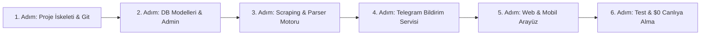

# 🚀 BulBana — Akıllı İlan Takip & Anlık Bildirim Platformu
## 📄 Proje Mimari ve Geliştirme Yol Haritası (Project Blueprint)

---

## 1. 🎯 Proje Özeti ve Amacı

**BulBana**, kullanıcının aradığı özel kriterlerdeki (örneğin: *"Kırmızı renkli, ağır hasar kayıtsız, 2018 model üstü Renault Clio"* veya *"Kadıköy'de 30.000 TL altı 2+1 daire"*) ilanları Sahibinden üzerinde **otomatik olarak periyodik tarayan**, kriterlere uyan yeni bir ilan yayınlandığı anda kullanıcıya **anlık bildirim (Telegram Botu & Web)** gönderen ve uygun ilanları akıllıca sıralayan **%100 ücretsiz** bir takip ve asistan sistemidir.

---

## 2. 💰 $0 Maliyetli Teknoloji Yığını (Tech Stack)

Bu projenin geliştirilmesinde, test edilmesinde ve canlıya alınmasında **hiçbir ücretli servis kullanılmayacaktır**.

| Katman | Teknoloji | Açıklama & $0 Nedeni |
| :--- | :--- | :--- |
| **Backend & API** | **Python 3.12+ / Django 5.x & DRF** | Güçlü ORM, Admin Paneli ve REST API |
| **Veritabanı** | **SQLite (Yerel) / Supabase PostgreSQL (Canlı)** | 500 MB ücretsiz bulut PostgreSQL |
| **Veri Çekme (Scraping)** | **Playwright / BeautifulSoup4 / Requests** | Ücretsiz, dinamik sayfaları yakalayan güçlü web botu |
| **Arka Plan Görevleri** | **APScheduler / Celery** | Belirlenen aralıklarla (örn: 5 dakikada bir) otomatik tarama |
| **Anlık Bildirim** | **Telegram Bot API** | Kullanıcının cep telefonuna fotoğraflı, linkli ücretsiz bildirim |
| **Frontend (Web & Mobil)** | **HTML5, TailwindCSS / Bootstrap 5, Vanilla JS** | Mobil uyumlu (PWA ready), hafif ve hızlı responsive arayüz |
| **Yapay Zeka (Opsiyonel)** | **Google Gemini 2.0 / Flash API** | Günde 1.500 istek ücretsiz (İlan açıklaması analizi için) |
| **Versiyon Kontrol** | **Git & GitHub** | Kodların güvenli takibi ve açık kaynak portfolyo |

---

## 3. 🧩 Sistem Mimarisi ve Çalışma Mantığı

```mermaid
flowchart TD
    subgraph Kullanıcı_Arayüzü ["👤 Kullanıcı Katmanı (Web & Mobil)"]
        User["Kullanıcı"] -->|1. Kullanıcı Adı ile Giriş| Login["Hızlı Giriş Ekranı"]
        Login --> Dashboard["Kullanıcı Paneli & Arama Formu"]
        Dashboard -->|2. Kriter Kaydet (Örn: Kırmızı, Hasarsız Clio)| SaveTarget["Alarm Oluştur"]
    end

    subgraph Backend_Core ["⚙️ Django Backend & Veritabanı"]
        SaveTarget --> DB_Target[("Arama Kriterleri (SearchTarget)")]
        Scheduler["Zamanlayıcı (Scheduler - 5 Dk'da Bir)"] -->|Hedefleri Oku| DB_Target
        Scheduler --> Scraper["Akıllı Veri Çekme Motoru (Scraper)"]
    end

    subgraph External_Web ["🌐 Dış Kaynak"]
        Scraper -->|3. Filtreli Arama İsteği At| Sahibinden[("Sahibinden Web Sitesi")]
        Sahibinden -->|4. Ham HTML / İlan Listesi| Scraper
    end

    subgraph Processing_Alert ["🔔 İşleme & Anlık Bildirim"]
        Scraper --> Parser["İlan Ayrıştırıcı (Parser & Cleaner)"]
        Parser --> DB_Listings[("Kayıtlı İlanlar (ScrapedListing)")]
        DB_Listings -->|Yeni İlan Tespit Edildiğinde| Notifier["Bildirim Servisi (Notification Service)"]
        Notifier -->|5. Anlık Mesaj & Fotoğraf| TelegramBot["📲 Telegram Botu"]
        Notifier -->|6. Panelde Listele| Dashboard
        TelegramBot -->|7. Cebe Bildirim Gelir| User
    end
```

---

## 4. 🗄️ Veritabanı Modelleri (Database Schema)

### 1. `UserProfile` (Kullanıcı Profili)
* `username`: Benzersiz kullanıcı adı (Hızlı giriş için).
* `telegram_chat_id`: Kullanıcının bildirim alacağı Telegram ID'si (Opsiyonel).
* `created_at`: Oluşturulma tarihi.

### 2. `SearchTarget` (Arama Kriteri / Alarm)
* `user`: Hangi kullanıcıya ait olduğu (`ForeignKey -> UserProfile`).
* `title`: Alarm başlığı (Örn: *"Kırmızı Clio 2018+"*).
* `category`: Kategori (Vasıta, Emlak, İkinci El).
* `query_url`: Sahibinden arama URL'i veya oluşturulan filtre URL'i.
* `min_price` / `max_price`: Fiyat aralığı.
* `keywords`: İlan açıklamasında/başlığında aranan kelimeler (Örn: *"kırmızı, hatasız, boyasız"*).
* `excluded_keywords`: İstenmeyen kelimeler (Örn: *"ağır hasar, pert, taksi çıkması"*).
* `is_active`: Alarmın aktiflik durumu (True/False).
* `check_interval_minutes`: Kaç dakikada bir taranacağı (Varsayılan: 5 dk).
* `last_checked_at`: Son kontrol zamanı.

### 3. `ScrapedListing` (Çekilen & Eşleşen İlan)
* `target`: Hangi arama kriteriyle eşleştiği (`ForeignKey -> SearchTarget`).
* `external_id`: Sahibinden ilan numarası (Tekrar eden ilanları engellemek için `unique`).
* `title`: İlan başlığı.
* `price`: İlan fiyatı.
* `location`: Şehir / İlçe.
* `image_url`: İlan kapak görseli linki.
* `listing_url`: Doğrudan ilana giden link.
* `published_date`: İlanın yayınlanma tarihi/saati.
* `is_notified`: Kullanıcıya bildirimi atıldı mı? (True/False).
* `created_at`: Sisteme kayıt tarihi.

---

## 5. 🛠️ Adım Adım Geliştirme Yol Haritası (Execution Roadmap)



### 🔹 1. Adım: Temiz Çevre Kurulumu & Git Entegrasyonu
* Eski `bulbana` dosyalarını temizleme, temiz sanal ortam (`.venv`) ve `requirements.txt` hazırlama.
* Git reposunu sıfırlayıp GitHub'a ilk temiz commit'i atma.

### 🔹 2. Adım: Django Veri Modelleri & Kolay Admin Yönetimi
* `UserProfile`, `SearchTarget`, `ScrapedListing` modellerini kodlama.
* Veritabanı migrasyonlarını çalıştırma ve Django Admin'de test etme.

### 🔹 3. Adım: Akıllı Scraping & Filtreleme Motoru
* `services/scraper_service.py` modülü: Sahibinden sayfalarından güvenli, IP ban yemeyecek şekilde başlık, fiyat, görsel, ilan no ve detay çekme.
* `services/filter_service.py` modülü: Çekilen ilanları kullanıcının pozitif (`kırmızı`) ve negatif (`ağır hasar`) anahtar kelimeleriyle eleme.

### 🔹 4. Adım: %100 Ücretsiz Telegram Bildirim Sistemi
* Telegram Botu oluşturma (`BotFather` üzerinden 1 dakikada ücretsiz bot açma).
* Yeni bir ilan bulunduğunda kullanıcının cebine fotoğraflı, fiyatlı ve linkli mesaj fırlatma.

### 🔹 5. Adım: Modern, Mobil Uyumlu Web Arayüzü (UI/UX)
* Kullanıcı adı ile tek tıkla giriş ekranı.
* "Yeni Alarm Ekle" formu (Araç rengi, modeli, hasar durumu, fiyat aralığı seçimi).
* Kullanıcıya özel bulunan fırsat ilanlarının şık kartlar halinde sıralandığı akıllı panel.

### 🔹 6. Adım: Otomatik Zamanlayıcı (Scheduler) & Canlıya Alma
* Arka planda 5 dakikada bir otomatik çalışan tarama döngüsünü başlatma.
* Projeyi GitHub üzerinden $0 maliyetle canlıya alma (Render/Vercel).

---

## 6. 🛡️ Güvenlik, Anti-Bot & Kalite Standartları
* **Bot Koruması & Rate Limit:** Sahibinden'e yüklenmemek ve IP engeli almamak için istekler arasına rastgele bekleme süreleri (jitter delay) ve gerçekçi `User-Agent` başlıkları koyulacaktır.
* **Mükerrer Veri Koruması:** `external_id` (İlan No) kontrolü ile aynı ilan için kullanıcıya asla birden fazla bildirim gitmeyecektir.
* **Modüler Kod:** İş mantığı `views.py` içine yığılmayacak; `services/` klasörü altında tertemiz ayrılacaktır.
