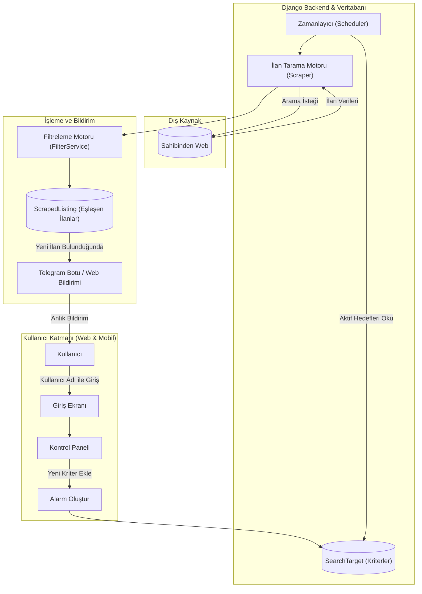

# BulBana - Akıllı İlan Takip ve Anlık Bildirim Platformu
## Proje Mimarisi ve Geliştirme Dokümanı

---

## 1. Proje Özeti ve Amacı

BulBana, kullanıcının belirlediği özel kriterlerdeki (örn: Belirli marka, model, renk, hasarsızlık durumu, fiyat aralığı, konum ve emlak oda sayısı vb.) ilanları Sahibinden üzerinde otomatik ve periyodik olarak tarayan, kriterlere uyan yeni bir ilan yayınlandığı anda kullanıcıya anlık bildirim (Telegram Botu ve Web Paneli) gönderen ve uygun ilanları filtreleyip listeleyen ücretsiz bir ilan takip platformudur.

---

## 2. Teknoloji Mimarisi (Tech Stack)

Projenin geliştirilmesinde ve canlıya alınmasında aşağıdaki açık kaynak ve ücretsiz teknolojiler kullanılmaktadır:

| Katman | Teknoloji | Açıklama |
| :--- | :--- | :--- |
| **Backend & API** | Python 3.12+ / Django 5.1+ | ORM, yönetim paneli ve iş mantığı çekirdeği |
| **Veritabanı** | SQLite (Yerel Geliştirme) / PostgreSQL (Üretim) | İlan, hedef ve kullanıcı verilerinin saklanması |
| **Veri Çekme (Scraping)** | BeautifulSoup4 / Requests | Sayfa ayrıştırma ve ilan detaylarını yakalama motoru |
| **Bildirim Servisi** | Telegram Bot API | Kullanıcıya anlık fotoğraflı ve linkli mesaj iletimi |
| **Ön Yüz (UI)** | HTML5, Tailwind CSS, Vanilla JS | Mobil uyumlu duyarlı (responsive) kontrol paneli |
| **Versiyon Kontrol** | Git & GitHub | Kaynak kod yönetimi ve sürüm takibi |

---

## 3. Sistem Mimarisi ve Çalışma Akışı

---

## 4. Veritabanı Modelleri (Database Schema)

### 1. UserProfile (Kullanıcı Profili)
* `username`: Benzersiz kullanıcı adı (Şifresiz/hızlı giriş).
* `telegram_chat_id`: Kullanıcının bildirim alacağı Telegram ID bilgisi.
* `created_at`: Profil oluşturulma tarihi.

### 2. SearchTarget (Arama Kriteri / Alarm)
* `user`: İlgili kullanıcı (`ForeignKey -> UserProfile`).
* `title`: Alarm başlığı (Örn: Kırmızı Hasarsız Clio 2020, Kadıköy 2+1 Daire).
* `category`: Kategori (Vasıta, Emlak, İkinci El).
* `city` / `town`: Şehir ve ilçe filtreleri.
* `min_price` / `max_price`: Fiyat limitleri.
* `search_url`: Sahibinden arama URL'i.
* `filter_criteria` (JSONField): Tüm özel filtreleri (Marka, model, yıl min/max, km max, vites, yakıt, renk, hasar durumu, oda sayısı, m2, bina yaşı, balkon, eşyalı vb.) saklayan dinamik alan.
* `keywords`: Aranacak pozitif anahtar kelimeler.
* `negative_keywords`: Hariç tutulacak negatif anahtar kelimeler (Örn: ağır hasar, pert, taksi çıkması).
* `is_active`: Alarm aktiflik durumu.
* `last_checked_at`: Son kontrol zamanı.
* `created_at`: Oluşturulma tarihi.

### 3. ScrapedListing (Eşleşen İlan)
* `target`: İlişkili arama hedefi (`ForeignKey -> SearchTarget`).
* `external_id`: Sahibinden ilan numarası (Mükerrer kayıt engelleme için `unique_together`).
* `title`: İlan başlığı.
* `price`: İlan fiyatı.
* `location`: Şehir / İlçe.
* `image_url`: Kapak görseli URL'i.
* `listing_url`: Doğrudan ilan detay linki.
* `published_date`: Yayınlanma tarihi.
* `attributes` (JSONField): İlan özellikleri.
* `is_notified`: Bildirimin gönderilip gönderilmediği.
* `created_at`: Sisteme kayıt tarihi.

---

## 5. Geliştirme Adımları

### 1. Adım: Temel Yapı ve Veritabanı Modelleri
* Django ortam kurulumu, ayar dosyaları ve bağımlılıkların yapılandırılması.
* `UserProfile`, `SearchTarget` ve `ScrapedListing` modellerinin oluşturulması ve migrasyonların uygulanması.

### 2. Adım: Filtreleme ve Eşleme Servisi (FilterService)
* Pozitif kelime, negatif kelime, fiyat aralığı, yıl ve lokasyon doğrulamasını yapan servis katmanının kodlanması.

### 3. Adım: Web Tarama ve Ayrıştırma Motoru (ScraperService)
* Sahibinden arama sonuçlarını HTTP üzerinden güvenle parse eden, ilan numarası kontrolüyle mükerrer kayıtları önleyen ve eşleşen ilanları kaydeden servis.

### 4. Adım: Telegram Bildirim Entegrasyonu (TelegramService)
* Telegram Bot API üzerinden bulunan yeni ilanlar için kullanıcının telefonuna fotoğraflı, fiyatlı ve linkli bildirim gönderen mekanizma.

### 5. Adım: Kullanıcı Arayüzü (UI/UX)
* Kullanıcı giriş ekranı (`login.html`), kontrol paneli (`dashboard.html`) ve dinamik kategori formunu içeren alarm ekleme ekranı (`add_target.html`).

### 6. Adım: Otomasyon ve Zamanlayıcı
* Arka planda periyodik tarama yapan `run_scanner` yönetim komutu ve periyodik çalışma döngüsü.

---

## 6. Güvenlik ve Performans Kuralları

* **Mükerrer Kayıt Engeli:** Veritabanında `unique_together = ('target', 'external_id')` kısıtıyla aynı ilan için tekrar bildirim gitmesi önlenir.
* **Hata Yönetimi:** Dış kaynak erişimlerinde oluşabilecek bağlantı kopmaları veya HTTP hataları izole edilerek sistem çalışması kesintiye uğratılmaz.
* **Modüler Tasarım:** İş mantığı `views.py` yerine `services/` klasörü altında ayrık servislerde yönetilir.
